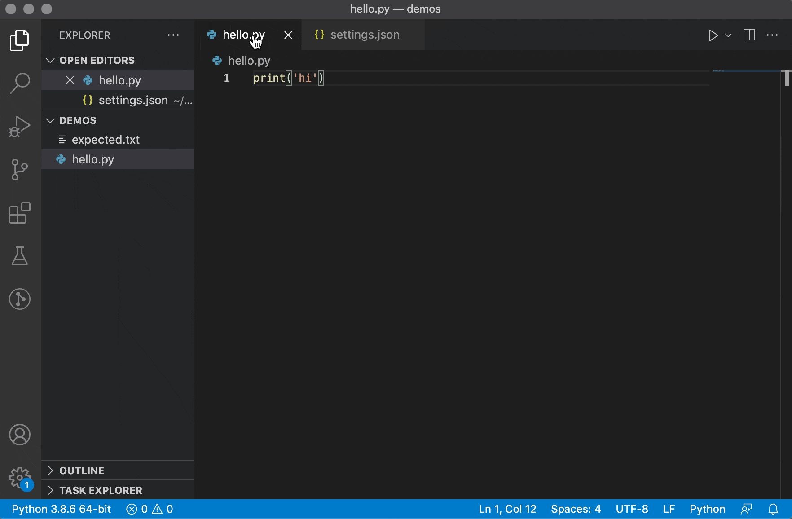
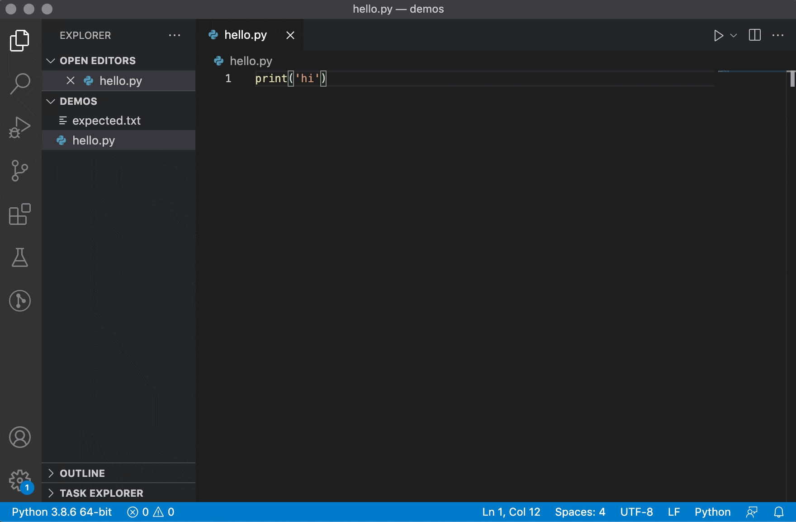
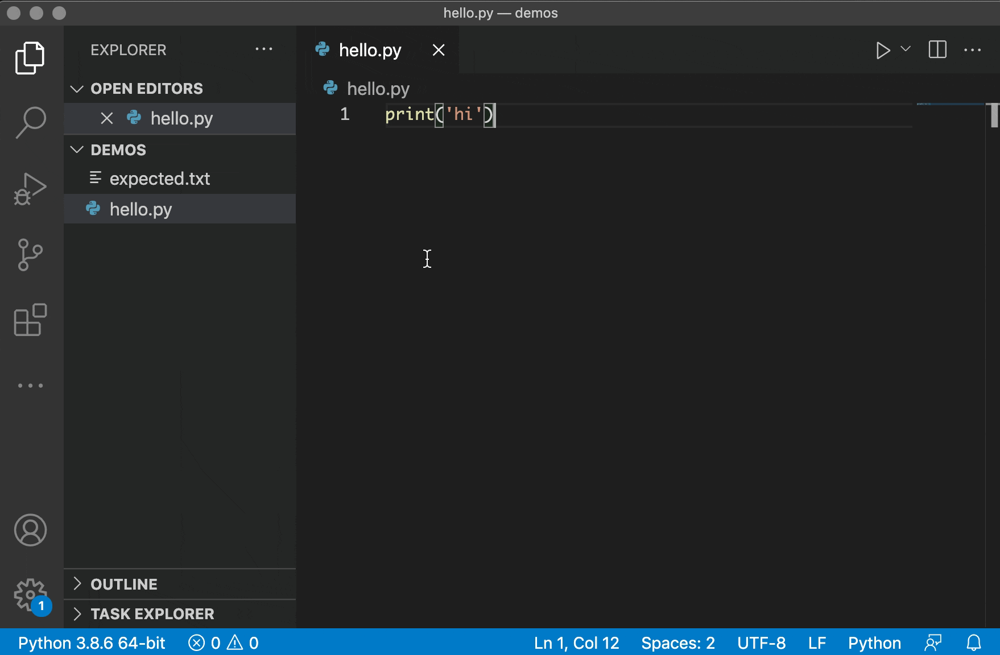

# vscode-run-diff

## Features

Use the `alt+shift+z` keybinding to run your active Python file and diff expected versus actual program output:

## Requirements

Ensure that you have `python3` on PATH, pointing to a valid [Python 3](https://python.org) installation.

## Extension Settings

This extension contributes one setting, `vscode-run-diff.expectedOutputFilePath`: Path to a file containing expected program output. 

If this setting is omitted, you will be prompted to select the file containing expected program output from the system file picker dialog on each run:

